## Exercise 1: Discover and assess the on-premises environment

Duration: 60 minutes

In this exercise, you will use Azure Migrate: Server Assessment to assess the on-premises environment. This will include selecting Azure Migrate tools, deploying the Azure Migrate appliance into the on-premises environment, creating a migration assessment, and using the Azure Migrate dependency visualization.

### Task 1: Create the Azure Migrate project and add assessment and migration tools

In this task, you will create the Azure Migrate project and select the assessment and migration tools.

> **Note**: In this lab, you will use the Microsoft-provided assessment and migration tools within Azure Migrate. A number of third-party tools are also integrated with Azure Migrate for both assessment and migration. You may wish to spend some time exploring these third-party options outside of this lab.

1. Click on **Azure portal** shortcut in the desktop and log in with below Azure subscription credentials.

    * Azure Usename/Email: <inject key="AzureAdUserEmail"></inject>
    * Azure Password: <inject key="AzureAdUserPassword"></inject>

2. Select **All services** in the portal's left navigation, then search for and select **Azure Migrate** to open the Azure Migrate Overview blade, shown below.

    

3. On the overview blade of Azure Migrate, Click on the **Assess and Migrate Server** and click on **Create project** button. 
   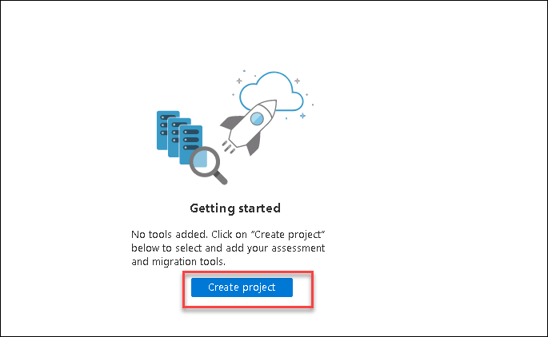

4. Select **Azure MigrateRG** in Resource group, Enter Project name as **SmartHotelMigration**, Select you resource group geography and then click on **Create** button.

    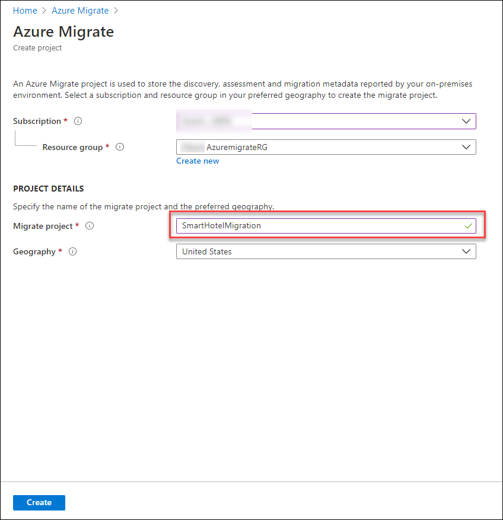
    
5. The Azure Migrate deployment will start. Once it has completed, select the **Servers** panel of the Azure Migrate blade (it may open automatically). You should now see the **Azure Migrate: Server Assessment** and **Azure Migrate: Server Migration** panels for the current migration project, as shown below.

    

#### Task summary 

In this task you created an Azure Migrate project, selecting the built-in tools for assessment and migration.

### Task 2: Deploy the Azure Migrate appliance

In this task, you will deploy and configure the Azure Migrate appliance in the on-premises Hyper-V environment. This appliance communicates with the Hyper-V server to gather configuration and performance data about your on-premises VMs.

1. Select **Discover** under **Azure Migrate: Server Assessment** to open the **Discover machines** blade on the right. Under **Are your machines virtualized?**, select **Yes, with Hyper-V**. Enter **Smarthotelhost** in **Name your appliance** and click on **Generate key** button and copy the key and save it in clipboard. we will use these keys in next excersie.

    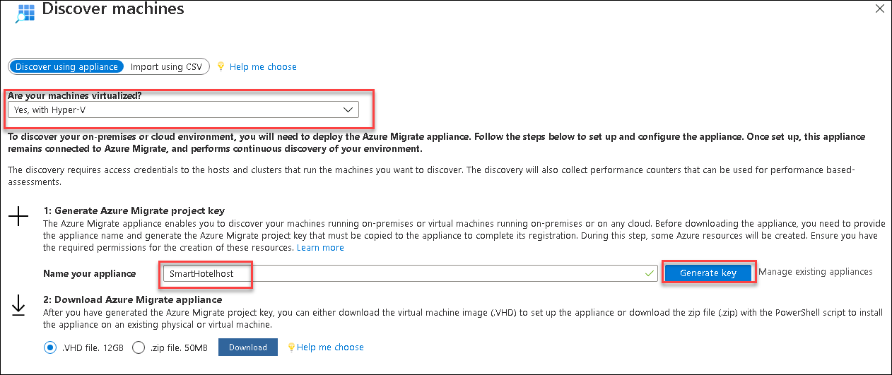

    Read through the instructions on how to download, deploy and configure the Azure Migrate appliance. Close the 'Discover machines' blade (do **not** download the .VHD file, it has already been downloaded for you).

2. In Server Manager, select **Tools**, then **Hyper-V Manager** (if Server Manager is not open, open it by selecting **Start**, then **Server Manager**). In Hyper-V manager, select **SMARTHOTELSUFFIX**. You should now see a list of the four VMs that comprise the on-premises SmartHotel application.

    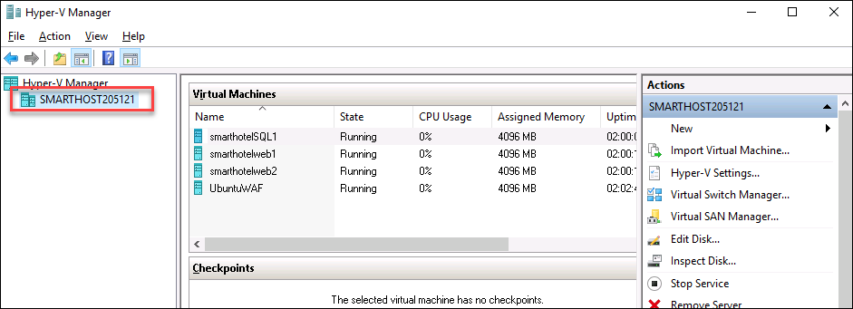

    You will now deploy the Azure Migrate appliance virtual machine.  Normally, you would first need to download the .ZIP file containing the appliance to your Hyper-V host, and unzip it. To save time, these steps have been completed for you.

3. In Hyper-V Manager, under **Actions**, select **Import Virtual Machine...** to open the **Import Virtual Machine** wizard.

    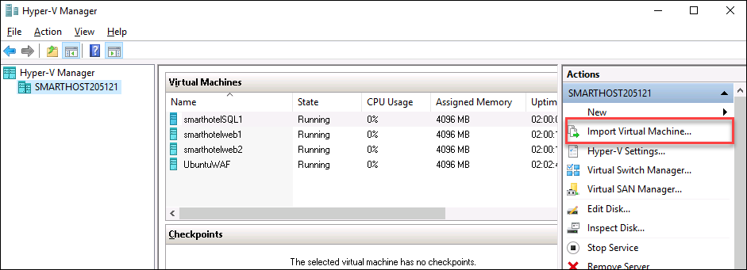

4. At the first step, **Before You Begin**, select **Next**.

5. At the **Locate Folder** step, select **Browse** and navigate to **F:\\VirtualMachines\\AzureMigrateAppliance** (the folder name may also include a version number), then choose **Select Folder**, then select **Next**.

    

6. At the **Select Virtual Machine** step, the **AzureMigrateAppliance** VM should already be selected. Select **Next**.

7. At the **Choose Import Type** step, keep the default setting **Register the virtual machine in-place**. Select **Next**.

8. At the **Connect Network** step, you will see an error that the virtual switch previously used by the Azure Migrate appliance could not be found. From the **Connection** drop down, select the **Azure Migrate Switch**, then select **Next**.

    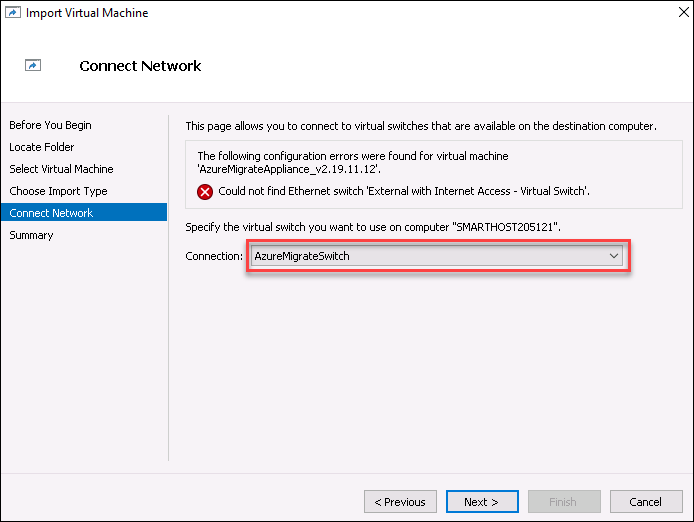

    > **Note**:  The Azure Migrate appliance needs access to the Internet to upload data to Azure. It also needs access to the Hyper-V host. However, it does not need direct access to the application VMs running on the Hyper-V host. To protect the application environment, the Azure Migrate Appliance should be deployed to a separate subnet within Hyper-V, rather than in the same subnet as your application. 
    >
    > The Hyper-V environment has a NAT network using the IP address space 192.168.0.0/16. The internal NAT switch used by the SmartHotel application uses the subnet 192.168.0.0/24, and each VM in the application has been assigned a static IP address from this subnet.
    >
    > The Azure Migrate Appliance will be connected to a separate subnet 192.168.1.0/24, which has been set up for you. Using the 'Azure Migrate Switch' connects the appliance to this subnet. The appliance is assigned an IP address from this subnet using a DHCP service running on the SmartHotelHost.

9. Review the summary page, then select **Finish** to create the Azure Migrate appliance VM.

10. In Hyper-V Manager, select the **AzureMigrateAppliance** VM, then select **Start** on the left.

   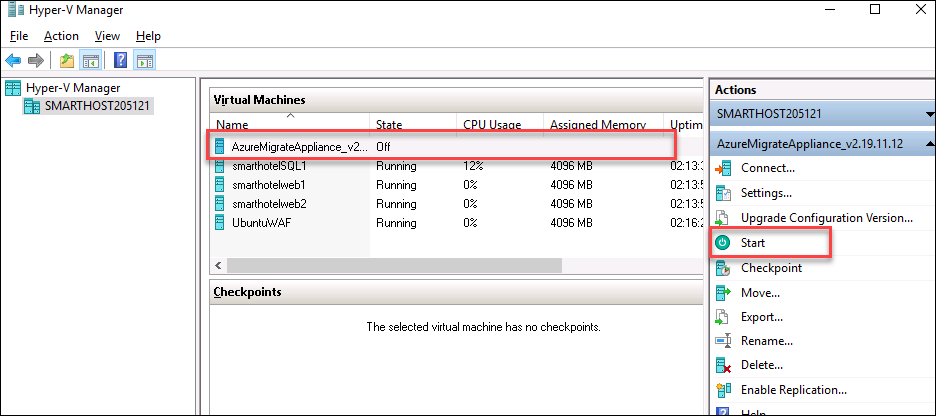

#### Task summary 

In this task you deployed the Azure Migrate appliance in the on-premises Hyper-V environment.

### Task 3: Configure the Azure Migrate appliance

In this task, you will configure the Azure Migrate appliance and use it to complete the discovery phase of the migration assessment.

1. In Hyper-V Manager, select the **AzureMigrateAppliance** VM, then select **Connect** on the left.

    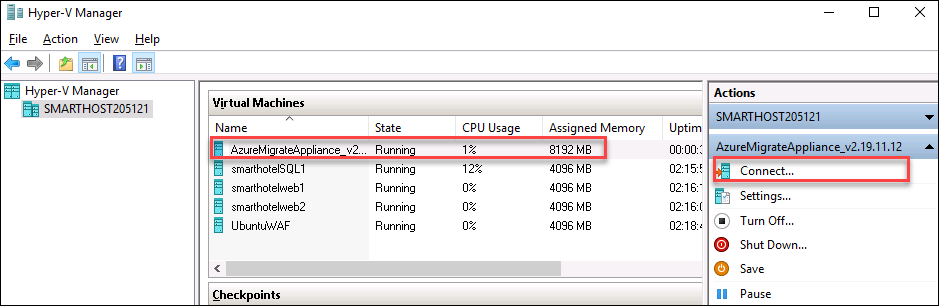

2. A new window will open showing the Azure Migrate appliance. Wait for the License terms screen to show, then select **Accept**.

    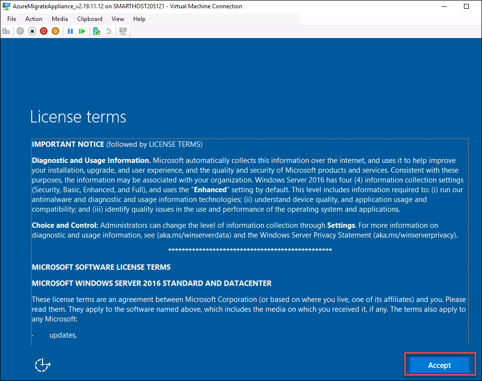

3. On the **Customize settings** screen, set the Administrator password to **demo!pass123** (twice). Then select **Finish**.

    > **Note**: When entering the password, the VM uses a US keyboard mapping. If you are using a non-US keyboard, some characters may be entered incorrectly. Select the 'eyeball' icon in the second password entry box to check the password has been entered correctly.

    

4. At the **Connect to AzureMigrateAppliance** prompt, set the appliance screen size using the slider, then select **Connect**.

5. Log in with the Administrator password **demo!pass123** (the login screen may pick up your local keyboard mapping, use the 'eyeball' icon to check).

6. **Wait.** After a minute or two, an Microsoft Edge browser will open showing the Azure Migrate appliance configuration wizard. Click on I Aggree button and it will start setting up the prerequisites.(If you see any popup related to the new update, please click on refresh button)

    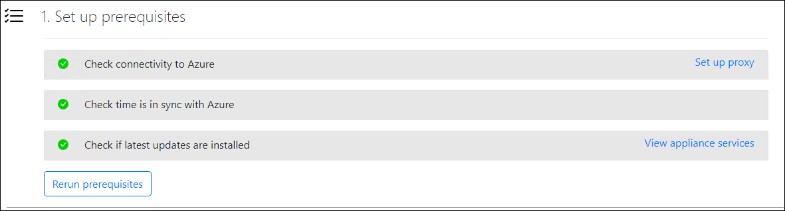
        
7. Now Paste Key you copied in last step and click on **Login** and then on the tab that loads up, click **Next** after verifying a code is there by default. 

    

8. Provide the following email id in the Sign in blade that comes up prompting to Microsoft Azure Powershell on a remote device or service :
   * **Email/Username**: <inject key="AzureAdUserEmail"></inject>
	   
	 
	 
9. Now enter the following password and click on **Sign in**. Once logged into Azure, close only the "**Browser Tab**" where you logged in to Azure and return to the other tab .
   * **Password**: <inject key="AzureAdUserPassword"></inject>	
   
        	 

10. Under **Registrate with Azure Migrate**,  After a few minutes you will see logged in as your credentials.

    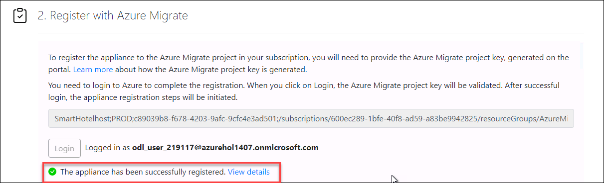

11. Under **Manage credentials and discovery sources**, Click on **Add Credentials** Enter Friendly name **Smarthotel**, Enter Username as **demouse** an Password as **demo!pass123** and click on Save button.

   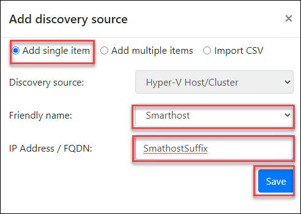

12. At the next phase of the wizard,  Click on **Add discovery source** button and select **add single item**, Enter **smarthotel** as friendly name, Enter **SmartHostSUFFIX**as Ip Address/FQDN. If it shows Azure login expired then Click on Login button again under step 1.
    * Azure Usename/Email: <inject key="AzureAdUserEmail"></inject>
    * Azure Password: <inject key="AzureAdUserPassword"></inject>

16. Now Click on the **Validate** button and if the Validation got Successfull then click on the **Start discovery** button.

    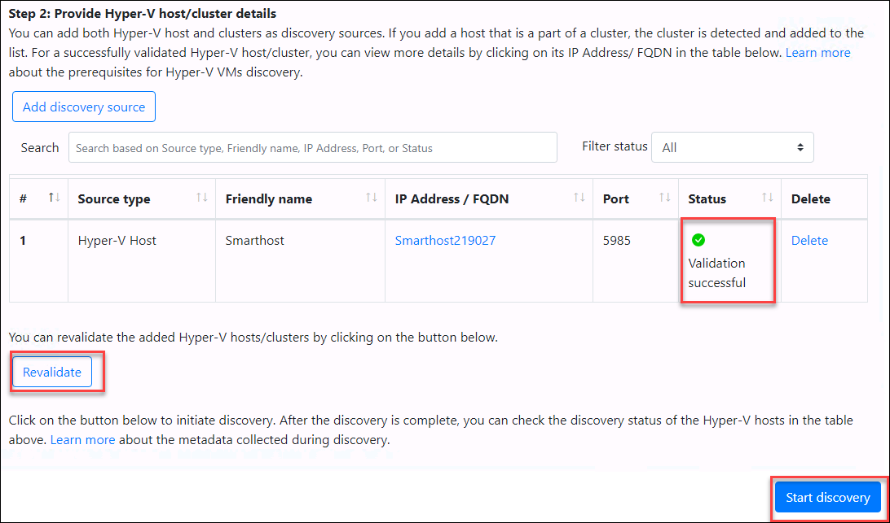

17. After the discovery got completed Click on **Azure Portal** URL button.

    


20. Return to the **Azure Migrate** blade in the Azure portal.  Select **Servers**, then select **Refresh**.  Under **Azure Migrate: Server Assessment** you should see a count of the number of servers discovered so far. If discovery is still in progress, select **Refresh** periodically until 5 discovered servers are shown. This may take several minutes.

    

>**Wait for the discovery process to complete before proceeding to the next Task**.

#### Task summary 

In this task you configured the Azure Migrate appliance in the on-premises Hyper-V environment and started the migration assessment discovery process.

### Task 4: Create a migration assessment

In this task, you will use Azure Migrate to create a migration assessment for the SmartHotel application, using the data gathered during the discovery phase.

1. Continuing from Task 3, select **Assess** under **Azure Migrate: Server Assessment** to start a new migration assessment.

    

2. On the Assess servers blade, enter **SmartHotelAssessment** as the assessment name.

    

3. Under **Assessment properties**, select **View all**.

    

4. The **Assessment properties** blade allows you to tailor many of the settings used when making a migration assessment report. Take a few moments to explore the wide range of assessment properties. Hover over the information icons to see more details on each setting. Choose any settings you like, then select **Save**. (You have to make a change for the Save button to be enabled; if you don't want to make any changes, just close the blade.), Click on Next button.

    

5. On the Assess servers blade, under *Select machine to assess* provide the following details; **Select or create a group**, choose **Create New** and enter the group name **SmartHotel VMs**. Select the **smarthotelweb1**, **smarthotelweb2** and **UbuntuWAF** VMs and then Click on **Next**.

    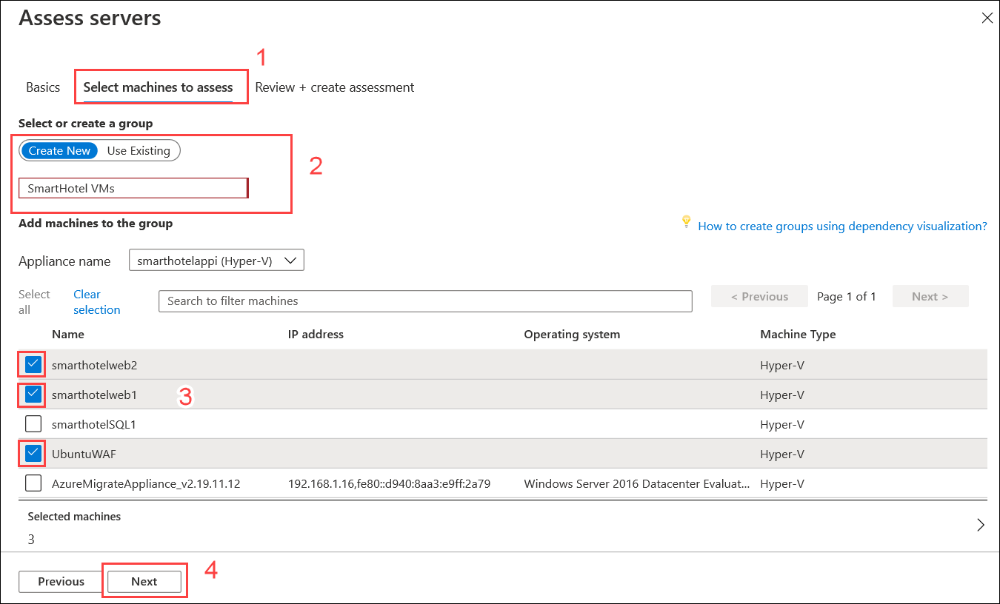
    
6. Review the migration assessment and Click on **Create assessment**.

    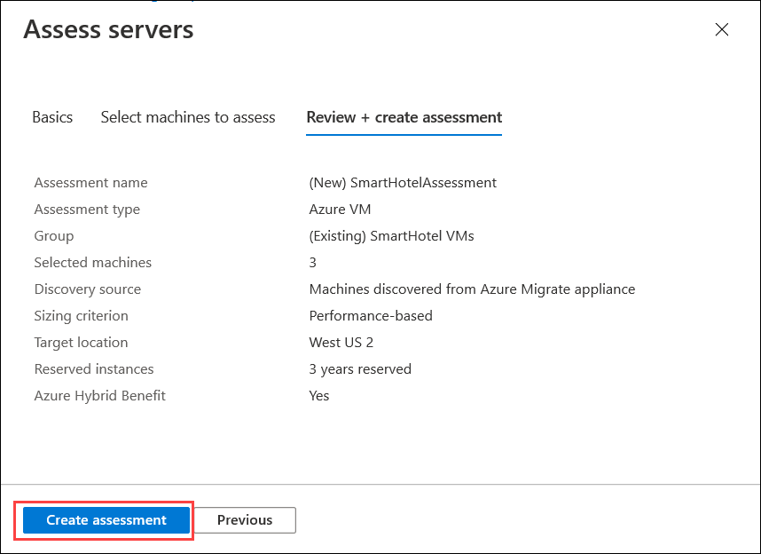

7. On the **Azure Migrate - Servers** blade, select **Refresh** periodically until the number of assessments shown is **1**. This may take several minutes.

    

8. Select **Assessments** under **Azure Migrate: Server Assessment** to see a list of assessments. Then select the actual assessment.

    

9. Take a moment to study the assessment overview.

    

10. Select **Edit properties**. Note how you can now modify the assessment properties you chose earlier. Change a selection of settings, and **Save** your changes. After a few moments, the assessment report will update to reflect your changes.

11. Select **Azure readiness** (either the chart or on the left navigation). Note that for each VM, a specific concern is listed regarding the readiness of the VM for migration.

    

12. Select **Unsupported boot type** for **smarthotelweb1**. A new browser tab opens showing Azure Migrate documentation. Note on the page that the issue relates to EFI boot not being supported, and the recommendation to migrate using Azure Migrate Server Migration, which will convert the boot type to BIOS.

    

13. Return to the portal browser tab to see details of the issue, and once again the suggestion to migrate using Azure Migrate Server Migration. (The 'Suggestion' text referring to Azure Site Recovery reflects that Azure Migrate: Server Migration uses Azure Site Recovery under the hood as the migration engine.)

    

14. Take a few minutes to explore other aspects of the migration assessment. Check why the UbuntuWAF is marked as 'conditionally ready for Azure', and explore the costs associated with the migration.

#### Task summary 

In this task you created and configured an Azure Migrate migration assessment.

### Task 5: Configure dependency visualization

When migrating a workload to Azure, it is important to understand all workload dependencies. A broken dependency could mean that the application doesn't run properly in Azure, perhaps in hard-to-detect ways. Some dependencies, such as those between application tiers, are obvious. Other dependencies, such as DNS lookups, Kerberos ticket validation or certificate revocation checks, are not.

In this task, you will configure the Azure Migrate dependency visualization feature. This requires you to first create a Log Analytics workspace, and then to deploy agents on the to-be-migrated VMs.

1. Return to the **Azure Migrate** blade in the Azure Portal, and select **Servers**. Under **Azure Migrate: Server Assessment** select **Groups**, then select the **SmartHotel VMs** group to see the group details. Note that each VM has their **Dependencies** status as **Requires agent installation**. Select **Requires agent installation** for the **smarthotelweb1** VM.

    

2. On the **Dependencies** blade, select **Configure OMS workspace**.

    

3. Create a new OMS workspace. Use **AzureMigrateWSSUFFFIX** as the workspace name, Choose a workspace location close to your lab deployment, then select **Configure**.

    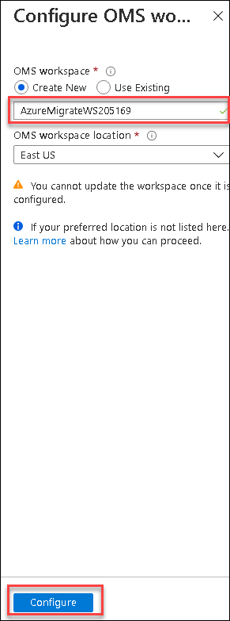

4. Wait for the workspace to be deployed. Once it is deployed, navigate to it and select **Advanced settings** under **Settings** on the left and then select **Connected Sources** from *Advanced settings* blade and click **Agents management**. Make a note of the **Workspace ID** and **Primary Key** (for example by using Notepad).

    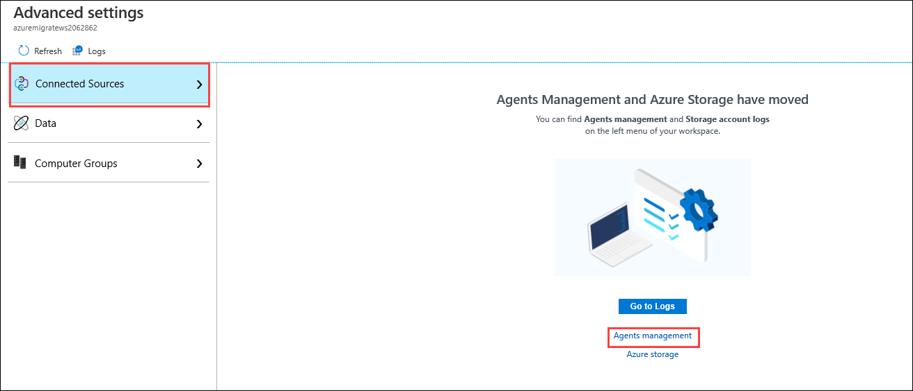
    
    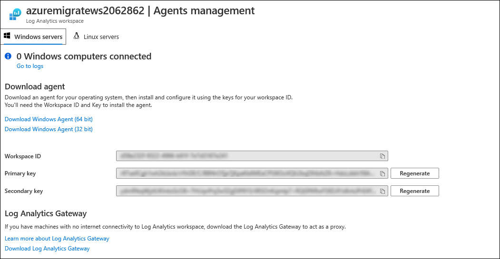
    

5. Right-click and copy the link in the address bar and make a note of it in Notepad. 
   
    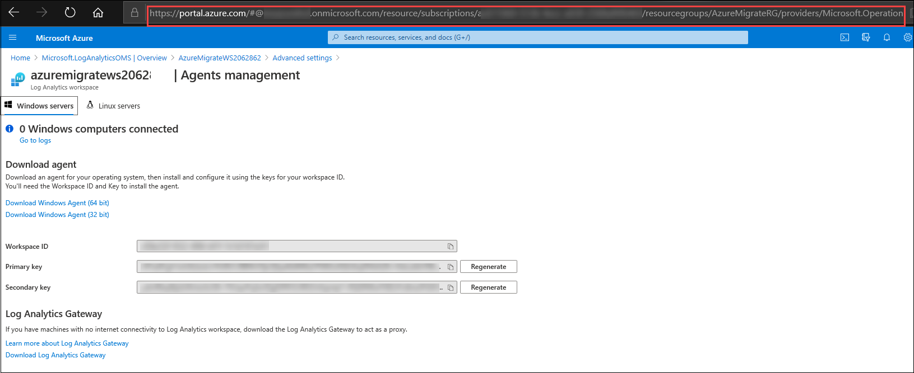

6. From **Hyper-V Manager** console, select **smarthotelweb1** and select **Connect**.

    

7. Select **Connect** again when prompted and log in to the **Administrator** account using the password **demo!pass123**.

8. Open **Internet Explorer**, and paste the link to the portal into the address bar. You may be prompted to sign in again. Choose the 64 bit download link and run the installer. 

    > **Note**: If Internet Explorer does not load the site properly you may need to turn of the **Internet Explorer Enhanced Security Configuration** on **Server Manager** under **Local Server** and install Chrome on the VM to navigate to the link. 

    

9. Select through the installation wizard until you get to the **Agent Setup Options** page. From there, select **Connect the agent to Azure Log Analytics (OMS)** and select **Next**. Enter your Workspace ID and Workspace Key that were copied earlier on the next page, and select **Azure Commercial** from the Azure Cloud drop-down. Select through the remaining pages and install the agent.

    

10. Paste the following link to the Dependency Agent Windows installer into the browser address bar. **Run** the installer and select through the install wizard to complete the installation.

    ```
    https://aka.ms/dependencyagentwindows
    ```

    

11. Close the virtual machine connection window for the **smarthotelweb1** VM.  Connect to the **smarthotelweb2** VM and repeat the installation process (steps 8-10) for both agents (the administrator password is the same as for smarthotelweb1) and close the Hyper

    You will now deploy the Linux versions of the Microsoft Monitoring Agent and Dependency Agent on the UbuntuWAF VM. To do so, you will first connect to the UbuntuWAF remotely using an SSH session to the IP address of the SmartHotelHost. The SmartHotelHost has been pre-configured with a NAT rule which forwards SSH connections to the UbuntuWAF VM.

12. Open a command prompt using the desktop shortcut.  

    > **Note**: The SmartHotelHost runs Windows Server 2019 with the Windows Subsystem for Linux enabled. This allows the command prompt to be used as an SSH client.

13. Enter the following command to connect to the **UbuntuWAF** VM running in Hyper-V on the SmartHotelHost:

    ```bash
    ssh demouser@192.168.0.8
    ```

14. Enter 'yes' when prompted whether to connect. Use the password **demo!pass123**.

    

15. Enter the following command, followed by the password **demo!pass123** when prompted:

    ```s
    sudo -s
    ```

    This gives the terminal session elevated privileges.

16. Enter the following command, substituting \<Workspace ID\> and \<Workspace Key\> with the values copied previously. Answer **<Yes>** when prompted to restart services during package upgrades without asking. 

    ```s
    wget https://raw.githubusercontent.com/Microsoft/OMS-Agent-for-Linux/master/installer/scripts/onboard_agent.sh && sh onboard_agent.sh -w <Workspace ID> -s <Workspace Key>
    ```

17. Enter the following command, substituting \<Workspace ID\> with the value copied earlier:

    ```s
    /opt/microsoft/omsagent/bin/service_control restart <Workspace ID>
    ```

18. Enter the following command. This downloads a script that will install the Dependency Agent.

    ```s
    wget --content-disposition https://aka.ms/dependencyagentlinux -O InstallDependencyAgent-Linux64.bin
    ```

19. Install the dependency agent by running the script download in the previous step.

    ```s
    sh InstallDependencyAgent-Linux64.bin -s
    ```

    

20. The agent installation is now complete. Next, you need to generate some traffic on the SmartHotel application so the dependency visualization has some data to work with. Browse to the public IP address of the SmartHotelHost, and spend a few minutes refreshing the page and checking guests in and out.

#### Task summary 

In this task you configured the Azure Migrate dependency visualization feature, by creating a Log Analytics workspace and deploying the Azure Monitoring Agent and Dependency Agent on both Windows and Linux on-premises machines.

### Task 6: Explore dependency visualization

In this task, you will explore the dependency visualization feature of Azure Migrate. This feature uses data gathered by the dependency agent you installed in Task 5.

1. Return to the Azure Portal and refresh the Azure Migrate **SmartHotel VMs** VM group blade. The 3 VMs on which the dependency agent was installed should now show their status as 'Installed'. (If not, refresh the page **using the browser refresh button**, not the refresh button in the blade.)

    

2. Select **View dependencies**.

    

3. Take a few minutes to explore the dependencies view. Expand each server to show the processes running on that server. Select a process to see process information. See which connections each server makes.

    


#### Task summary 

In this task you explored the Azure Migrate dependency visualization feature.

### Exercise summary 

In this exercise, you used Azure Migrate to assess the on-premises environment. This included selecting Azure Migrate tools, deploying the Azure Migrate appliance into the on-premises environment, creating a migration assessment, and using the Azure Migrate dependency visualization.
